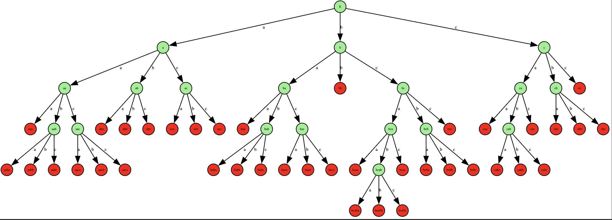

# Отчёт по lab1

## Задание

По имеющейся **SRS** требуется определить:

* **Завершимость**.
* **Конечность классов эквивалентности по НФ**
  (для эквивалентностей считаем, что правила применяются **в обе стороны**).
  Если классов конечное число — построить **минимальную** систему переписывания, им соответствующую.
* **Локальную конфлюэнтность** и **пополняемость по Кнуту–Бендиксу**.

---

## Исходная система правил (SRS)

```text
cc  -> aa
aaa -> aa
aaba -> ababaabcba
aacb -> aa
aabc -> aa
aba -> a
abc -> aa
aca -> abba
acb -> abb
baa -> aa
bb  -> aaaba
caa -> aa
cac -> ε
cba -> caca
cbc -> c
```

---

## 1) Завершимость

Существуют бесконечные переписывания: наблюдается **самовстраивание** паттерна `aaba`.

```text
aaba → ababaabcba                 (по правилу aaba→ababaabcba)
ababaabcba → ababaabcaca          (замена суффикса cba→caca)
ababaabcaca → ababaaba            (замена cac→ε)
```

В слове `ababaaba` снова присутствует подстрока `aaba` (последние 4 символа), значит
`aaba ⇒ ababaaba` и цикл повторяется бесконечно.

Отсюда легко получить бесконечное переписывание и из, например, `bb`:

```text
bb → aaaba  (содержит aaba) → … (бесконечный рост как выше)
```

**Вывод:** система **не терминируема**.

---

## 2) Конечность классов эквивалентности по НФ

Построением дерева доказано, что **нормальных форм длины > 4 не существует**; следовательно,
количество нормальных форм **конечно**, а значит и число классов эквивалентности по НФ конечно.
(См. граф-доказательство в папке `lab1`.)


---

## 3) Локальная конфлюэнтность и пополняемость (Кнут–Бендикс)

### 3.1 Локальная конфлюэнтность (контрпример)

Возьмём слово `acac`:

* По правилу `aca → abba`:
  `acac → abbac`
* По правилу `cac → ε`:
  `acac → a`

Дальше редукция первой ветки:

```text
abbac → (bb→aaaba) → aaabac → (aaa→aa) → aabac → (aba→a) → aac
```

Правая ветка даёт НФ `a`, левая ветка приводит к НФ `aac`. Эти НФ **не приводятся** друг к другу.

**Вывод:** система **локально не конфлюэнтна**.

### 3.2 Пополняемость по Кнуту–Бендиксу

Причины отсутствия пополнимости **в заданном направлении правил**:

1. Нет фундированного порядка, который ориентирует все правила строго убывающе:
   самовстраивание `aaba → (контекст с aaba)`.
2. Наличие **незамыкаемого цикла** (пример `acac` выше): даже при гипотетической терминируемости понадобились бы новые правила, но п.1 не даёт завершить систему с исходной ориентацией.

> **Система после пополнения.** 
>
> ```text
> a -> ε
> b -> ε
> c -> ε
> ```

Пополнение и доказательство, что все переходит в ε.

Пополнение
1. **`bba → aa`**
   **Из:** `aaaba→bb` и `ababaabcba→aaba` (base `aaabababaabcba`).
   **Сходимость:**
   U: `base ⇒ aaaba→bb ⇒ … ⇒ aa`
   V: `base ⇒ ababaabcba→aaba ⇒ … ⇒ bba`
   **Итог:** `bba ≡ aa` ⇒ добавляем `bba → aa`.

2. **`abb → aa`**
   **Из:** `aaaba→bb` и `ababaabcba→aaba` (base `aaababaabcba`).
   U: `base ⇒ aaaba→bb ⇒ … ⇒ aa`
   V: `base ⇒ ababaabcba→aaba ⇒ … ⇒ abb`
   **Итог:** `abb ≡ aa` ⇒ `abb → aa`.

3. **`aaca → aa`**
   **Из:** `ababaabcba→aaba` и `abba→aca` (base `ababaabcbabba`).
   U: `base ⇒ ababaabcba→aaba ⇒ … ⇒ aa`
   V: `base ⇒ abba→aca ⇒ … ⇒ aaca`
   **Итог:** `aaca ≡ aa` ⇒ `aaca → aa`.

4. **`bb → aa`**
   **Из:** `aaa→aa` и `ababaabcba→aaba` (base `aaababaabcba`).
   U: `base ⇒ aaa→aa ⇒ … ⇒ bb`
   V: `base ⇒ ababaabcba→aaba ⇒ … ⇒ aa`
   **Итог:** `bb ≡ aa` ⇒ `bb → aa`.

5. **`aab → aa`**
   **Из:** `abc→aa` и `ababaabcba→aaba` (base `ababaabcba`).
   U: `base ⇒ abc→aa (внутри) ⇒ … ⇒ aab`
   V: `base ⇒ ababaabcba→aaba ⇒ … ⇒ aa`
   **Итог:** `aab ≡ aa` ⇒ `aab → aa`.

6. **`aac → aa`**
   **Из:** `aabc→aa` и `cac→ε` (base `aabcac`).
   U: `base ⇒ aabc→aa ⇒ … ⇒ aac`
   V: `base ⇒ cac→ε ⇒ … ⇒ aa`
   **Итог:** `aac ≡ aa` ⇒ `aac → aa`.

7. **`aca → aa`**
   **Из:** `caca→cba` и `abba→aca` (base `cacabba`).
   U: `base ⇒ caca→cba ⇒ … ⇒ aa`
   V: `base ⇒ abba→aca ⇒ … ⇒ aca`
   **Итог:** `aca ≡ aa` ⇒ `aca → aa`.

8. **`ab → aa`**
   **Из:** `abba→aca` и `acb→abb` (base `abbacb`).
   U: `base ⇒ abba→aca ⇒ … ⇒ ab`
   V: `base ⇒ acb→abb ⇒ … ⇒ aa`
   **Итог:** `ab ≡ aa` ⇒ `ab → aa`.

9. **`ba → aa`**
   **Из:** `caca→cba` и `caca→cba` (base `cacaca`).
   U: `base ⇒ caca→cba ⇒ … ⇒ aa`
   V: `base ⇒ caca→cba ⇒ … ⇒ ba`
   **Итог:** `ba ≡ aa` ⇒ `ba → aa`.

10. **`aa → a`**
    **Из:** `caca→cba` и `aba→a` (base `cacaba`).
    U: `base ⇒ caca→cba ⇒ … ⇒ aa`
    V: `base ⇒ aba→a ⇒ … ⇒ a`
    **Итог:** `aa ≡ a` ⇒ `aa → a`.

11. **`ca → a`**
    **Из:** `caca→cba` и `cac→ε` (base `cacac`).
    U: `base ⇒ caca→cba ⇒ … ⇒ a`
    V: `base ⇒ cac→ε ⇒ … ⇒ ca`
    **Итог:** `ca ≡ a` ⇒ `ca → a`.

12. **`b → a`**
    **Из:** `cac→ε` и `acb→abb` (base `cacb`).
    U: `base ⇒ cac→ε ⇒ … ⇒ b`
    V: `base ⇒ acb→abb ⇒ … ⇒ a`
    **Итог:** `b ≡ a` ⇒ `b → a`.

13. **`ac → a`**
    **Из:** `acb→abb` и `cbc→c` (base `acbc`).
    U: `base ⇒ acb→abb ⇒ … ⇒ a`
    V: `base ⇒ cbc→c ⇒ … ⇒ ac`
    **Итог:** `ac ≡ a` ⇒ `ac → a`.

14. **`a → ε`**
    **Из:** `cac→ε` и `cbc→c` (base `cacbc`).
    U: `base ⇒ cac→ε ⇒ … ⇒ a`
    V: `base ⇒ cbc→c ⇒ … ⇒ ε`
    **Итог:** `a ≡ ε` ⇒ `a → ε`.

15. **`c → ε`**
    **Из:** `cac→ε` и `cc→aa` (base `cacc`).
    U: `base ⇒ cac→ε ⇒ … ⇒ c`
    V: `base ⇒ cc→aa ⇒ … ⇒ ε`
    **Итог:** `c ≡ ε` ⇒ `c → ε`.

**Итог:**
`a ⇒ ε`, `b ⇒ ε`, `c ⇒ ε`.

### Минимизация SRS

Минимальная система:

```text
a -> ε
b -> ε
c -> ε
```


---

## 4) Переупорядоченная исходная и пополненная система (shortlex; редукции в ε ограничены)

Переупорядоченная исходная система и без ε

```text
cc   → aa
aaa  → aa
aba  → a
abc  → aa
acb  → abb
baa  → aa
caa  → aa
cbc  → c
aabc → aa
aacb → aa
abba → aca
caca → cba
aaaba → bb
ababaabcba → aaba
```

1. **`bba → aa`**
   **Из:** `aaaba→bb` и `ababaabcba→aaba` (base `aaabababaabcba`).
   U: `base ⇒ aaaba→bb ⇒ … ⇒ aa`
   V: `base ⇒ ababaabcba→aaba ⇒ … ⇒ bba`

2. **`abb → aa`**
   **Из:** `aaaba→bb` и `ababaabcba→aaba` (base `aaababaabcba`).
   U: `base ⇒ aaaba→bb ⇒ … ⇒ aa`
   V: `base ⇒ ababaabcba→aaba ⇒ … ⇒ abb`

3. **`aaca → aa`**
   **Из:** `ababaabcba→aaba` и `abba→aca` (base `ababaabcbabba`).
   U: `base ⇒ ababaabcba→aaba ⇒ … ⇒ aa`
   V: `base ⇒ abba→aca ⇒ … ⇒ aaca`

4. **`bb → aa`**
   **Из:** `aaa→aa` и `ababaabcba→aaba` (base `aaababaabcba`).
   U: `base ⇒ aaa→aa ⇒ … ⇒ bb`
   V: `base ⇒ ababaabcba→aaba ⇒ … ⇒ aa`

5. **`aab → aa`**
   **Из:** `abc→aa` и `ababaabcba→aaba` (base `ababaabcba`).
   U: `base ⇒ (…abc…)→aa ⇒ … ⇒ aab`
   V: `base ⇒ ababaabcba→aaba ⇒ … ⇒ aa`

6. **`aac → aa`**
   **Из:** `aabc→aa` и `cc→aa` (base `aabcc`).
   U: `base ⇒ aabc→aa ⇒ … ⇒ aac`
   V: `base ⇒ cc→aa ⇒ … ⇒ aa`

7. **`aca → aa`**
   **Из:** `abba→aca` и `aba→a` (base `abbaba`).
   U: `base ⇒ abba→aca ⇒ … ⇒ aca`
   V: `base ⇒ aba→a ⇒ … ⇒ aa`

8. **`cba → aa`**
   **Из:** `caca→cba` и `aba→a` (base `cacaba`).
   U: `base ⇒ caca→cba ⇒ … ⇒ cba`
   V: `base ⇒ aba→a ⇒ … ⇒ aa`


9. **`ac → aa`**
   **Из:** `acb→abb` и `cbc→c` (base `acbc`).
   U: `base ⇒ acb→abb ⇒ … ⇒ aa`
   V: `base ⇒ cbc→c ⇒ … ⇒ ac`


Система после пополнения

```text
cc   → aa
aaa  → aa
aba  → a
abc  → aa
acb  → abb
baa  → aa
caa  → aa
cbc  → c
aabc → aa
aacb → aa
abba → aca
caca → cba
aaaba → bb
ababaabcba → aaba
bba -> aa
abb -> aa
aaca -> aa
bb -> aa
aab -> aa
aac -> aa
aca -> aa
cba -> aa
ac -> aa
```


## 6) Инварианты и тестирование
(так как изначальная система становится тривиальной, придуман инвариант на обновленной системе ради доп.баллов))))

## Инвариант `Phi`

Рассмотрим гомоморфизм

```
Phi: {a,b,c}^* -> M2(F2)
```

с свойствами:

```
Phi(ε)  = I = [[1,0],[0,1]]
Phi(uv) = Phi(u) · Phi(v)   (умножение матриц по модулю 2)
```

и заданный на буквах:

```
Phi(a) = [[0,0],[0,0]]
Phi(b) = [[0,1],[0,0]]   # E12
Phi(c) = [[0,0],[1,0]]   # E21
```

Для каждого правила `LHS → RHS` в обеих системах выполняется

```
Phi(LHS) = Phi(RHS)
```

Значит при любом переписывании значение `Phi(w)` сохраняется (это и есть инвариант).

### Интерпретация (5 классов значений)

| Значение `Phi(w)` | Обозначение | Смысл                                                               |
| ----------------- | ----------- |---------------------------------------------------------------------|
| `[[0,0],[0,0]]`   | `0`         | слово: содержит `a` **или** где-то есть `bb`/`cc`.                  |
| `[[0,1],[0,0]]`   | `B`         | Строгое чередование `b/c`, старт `b`, нечётная длина (напр. `bcb`). |
| `[[0,0],[1,0]]`   | `C`         | Строгое чередование `b/c`, старт `c`, нечётная длина (напр. `cbc`). |
| `[[1,0],[0,0]]`   | `BC`        | Строгое чередование `b/c`, старт `b`, чётная длина (напр. `bc`).    |
| `[[0,0],[0,1]]`   | `CB`        | Строгое чередование `b/c`, старт `c`, чётная длина (напр. `cb`).    |

Если `Phi(w) = 0`, слово выкинуто (есть `a` или подряд `bb/cc`).
Иначе `w` — строгое чередование по `{b,c}`, и класс полностью задаётся парой:

* `S(w)` — стартовая буква (`b` или `c`);
* `O(w)` — чётность длины (0 = чётная, 1 = нечётная).
