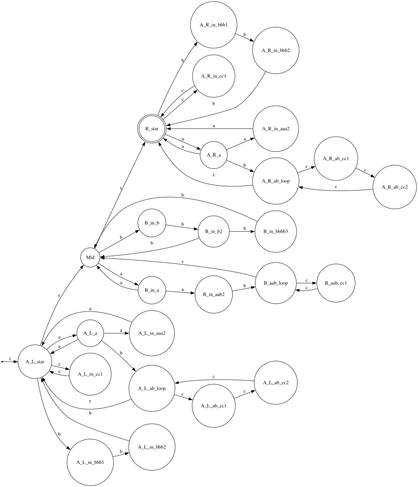
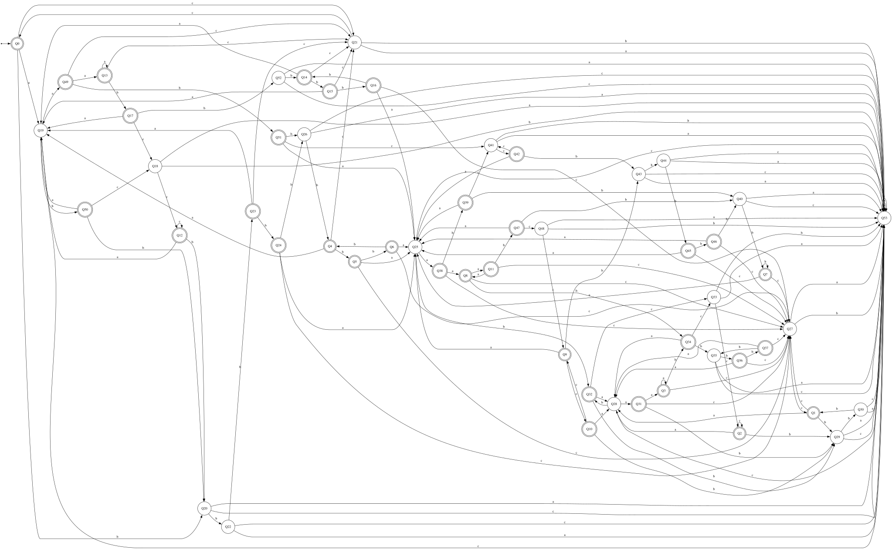
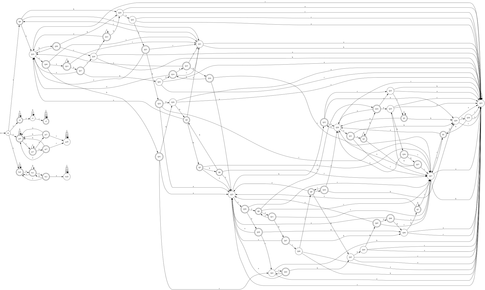

# Отчёт по lab2

Регулярное выражение:
`(aaa|bbb|cc|ab(ccc)*|aa)*(aa|bbb|aab(cc)*|bbbb)*(aaa|bbb|cc|ab(ccc)*|aa)*`
---
## НКА

НКА лежит в [`dot/nfa.dot`](dot/nfa.dot).

НКА:

Таблица:

| prefix \ suffix | caabaa | ccc | babaab | bbab | accaaa | abccaa |  b  |
|-----------------|:------:|:---:|:------:|:----:|:------:|:------:|:---:|
| ccabc           |   1    |  1  |   0    |  0   |   0    |   0    |  0  |
| aabaac          |   0    |  1  |   0    |  0   |   0    |  0     |  0  |
| ccbbba          |   0    |  0  |   1    |  0   |   1    |   1    |  1  |
| abb             |   0    |  0  |   0    |  1   |   0    |   0    |  0  |
| bbbba           |   0    |  0  |   0    |  0   |   1    |   1    |  1  |
| ε               |   0    |  0  |   0    |  0   |   0    |   1    |  0  |
| aababbb         |   0    |  0  |   0    |  0   |   0    |   0    |  1  |

## ДКА

ДКА лежит в [`dot/dfa.dot`](dot/dfa.dot).

ДКА:

Таблица:

| state | prefix    | ε | a | b | c | ab | bb | cc | aab | bbb | ccc | baab | bccc | caab | abaab | ccaab | babaab | cabaab | bbabaab |
|---    | ---       |---|---|---|---|----|----|----|-----|-----|-----|------|------|------|-------|-------|--------|--------|---------|
| q0  | ε          | 1 | 0 | 0 | 0 | 1 | 0 | 1 | 1 | 1 | 0 | 0 | 0 | 0 | 1 | 1 | 0 | 0 | 0 |
| q1  | bbbbcc     | 1 | 0 | 0 | 0 | 1 | 0 | 1 | 0 | 1 | 0 | 0 | 0 | 0 | 0 | 0 | 0 | 0 | 0 |
| q2  | aababcc    | 1 | 0 | 0 | 1 | 1 | 0 | 1 | 0 | 1 | 1 | 0 | 0 | 0 | 0 | 0 | 0 | 0 | 0 |
| q3  | aababaaa   | 1 | 1 | 1 | 0 | 1 | 0 | 1 | 1 | 1 | 0 | 0 | 1 | 0 | 0 | 0 | 0 | 0 | 0 |
| q4  | aabbb      | 1 | 0 | 1 | 0 | 1 | 1 | 1 | 1 | 1 | 0 | 1 | 0 | 0 | 1 | 1 | 0 | 0 | 0 |
| q5  | aabbbb     | 1 | 0 | 1 | 0 | 1 | 1 | 1 | 1 | 1 | 0 | 1 | 0 | 0 | 0 | 0 | 0 | 0 | 1 |
| q6  | aabbbbb    | 1 | 0 | 1 | 0 | 1 | 1 | 1 | 1 | 1 | 0 | 1 | 0 | 0 | 0 | 0 | 1 | 0 | 0 |
| q7  | aabaabbb   | 1 | 0 | 1 | 0 | 1 | 1 | 1 | 1 | 1 | 0 | 1 | 0 | 0 | 0 | 0 | 0 | 0 | 0 |
| q8  | aabaaa     | 1 | 1 | 1 | 0 | 1 | 0 | 1 | 1 | 1 | 0 | 1 | 1 | 0 | 1 | 0 | 0 | 0 | 0 |
| q9  | aabaaaabcc | 1 | 0 | 0 | 1 | 1 | 0 | 1 | 1 | 1 | 1 | 0 | 0 | 0 | 0 | 1 | 0 | 0 | 0 |
| q10 | aabaaaabccc| 1 | 0 | 0 | 1 | 1 | 0 | 1 | 0 | 1 | 1 | 0 | 0 | 1 | 0 | 0 | 0 | 0 | 0 |
| q11 | aabaaaa    | 1 | 1 | 1 | 0 | 1 | 0 | 1 | 1 | 1 | 0 | 1 | 1 | 0 | 0 | 0 | 0 | 0 | 0 |
| q12 | abcc       | 1 | 0 | 0 | 1 | 1 | 0 | 1 | 1 | 1 | 1 | 0 | 0 | 1 | 1 | 1 | 0 | 1 | 0 |
| q13 | aaa        | 1 | 1 | 1 | 0 | 1 | 0 | 1 | 1 | 1 | 0 | 1 | 1 | 0 | 1 | 1 | 1 | 0 | 0 |
| q14 | aaabbb     | 1 | 0 | 1 | 0 | 1 | 1 | 1 | 1 | 1 | 0 | 1 | 0 | 0 | 1 | 1 | 1 | 0 | 0 |
| q15 | aaabbbb    | 1 | 0 | 1 | 0 | 1 | 1 | 1 | 1 | 1 | 0 | 1 | 0 | 0 | 1 | 1 | 0 | 0 | 1 |
| q16 | aaabbbbb   | 1 | 0 | 1 | 0 | 1 | 1 | 1 | 1 | 1 | 0 | 1 | 0 | 0 | 0 | 0 | 1 | 0 | 1 |
| q17 | aaab       | 1 | 0 | 0 | 0 | 1 | 1 | 1 | 1 | 1 | 1 | 0 | 0 | 0 | 1 | 1 | 0 | 0 | 1 |
| q18 | abc        | 0 | 0 | 0 | 1 | 0 | 0 | 1 | 0 | 0 | 1 | 0 | 0 | 1 | 0 | 1 | 0 | 1 | 0 |
| q19 | a          | 0 | 1 | 1 | 0 | 1 | 0 | 0 | 1 | 0 | 0 | 1 | 1 | 0 | 1 | 0 | 1 | 0 | 0 |
| q20 | b          | 0 | 0 | 0 | 0 | 0 | 1 | 0 | 0 | 1 | 0 | 0 | 0 | 0 | 0 | 0 | 0 | 0 | 1 |
| q21 | c          | 0 | 0 | 0 | 1 | 0 | 0 | 0 | 0 | 0 | 1 | 0 | 0 | 1 | 0 | 0 | 0 | 1 | 0 |
| q22 | bb         | 0 | 0 | 1 | 0 | 0 | 1 | 0 | 0 | 0 | 0 | 1 | 0 | 0 | 0 | 0 | 1 | 0 | 0 |
| q23 | bbb        | 1 | 0 | 1 | 0 | 1 | 0 | 1 | 1 | 1 | 0 | 1 | 0 | 0 | 1 | 1 | 0 | 0 | 0 |
| q24 | bbbb       | 1 | 0 | 0 | 0 | 1 | 1 | 1 | 1 | 1 | 0 | 0 | 0 | 0 | 0 | 0 | 0 | 0 | 1 |
| q25 | aaba       | 0 | 1 | 1 | 0 | 1 | 0 | 0 | 1 | 0 | 0 | 0 | 1 | 0 | 1 | 0 | 0 | 0 | 0 |
| q26 | aabb       | 0 | 0 | 1 | 0 | 0 | 1 | 0 | 0 | 1 | 0 | 1 | 0 | 0 | 0 | 0 | 1 | 0 | 0 |
| q27 | bbbbc      | 0 | 0 | 0 | 1 | 0 | 0 | 0 | 0 | 0 | 1 | 0 | 0 | 0 | 0 | 0 | 0 | 0 | 0 |
| q28 | aababa     | 0 | 1 | 1 | 0 | 0 | 0 | 0 | 1 | 0 | 0 | 0 | 1 | 0 | 0 | 0 | 0 | 0 | 0 |
| q29 | aababb     | 0 | 0 | 0 | 0 | 0 | 1 | 0 | 0 | 0 | 0 | 0 | 0 | 0 | 0 | 0 | 0 | 0 | 0 |
| q30 | aababbb    | 0 | 0 | 1 | 0 | 0 | 0 | 0 | 0 | 0 | 0 | 0 | 0 | 0 | 0 | 0 | 0 | 0 | 0 |
| q31 | aababaa    | 1 | 1 | 0 | 0 | 1 | 0 | 1 | 1 | 1 | 0 | 0 | 0 | 0 | 0 | 0 | 0 | 0 | 0 |
| q32 | aabab      | 1 | 0 | 0 | 0 | 1 | 0 | 1 | 0 | 1 | 1 | 0 | 0 | 0 | 0 | 0 | 0 | 0 | 0 |
| q33 | aababc     | 0 | 0 | 0 | 1 | 0 | 0 | 1 | 0 | 0 | 1 | 0 | 0 | 0 | 0 | 0 | 0 | 0 | 0 |
| q34 | aabaaab    | 1 | 0 | 0 | 0 | 1 | 1 | 1 | 0 | 1 | 1 | 0 | 0 | 0 | 0 | 0 | 0 | 0 | 0 |
| q35 | aabaaabb   | 0 | 0 | 1 | 0 | 0 | 1 | 0 | 0 | 0 | 0 | 0 | 0 | 0 | 0 | 0 | 0 | 0 | 0 |
| q36 | aabaaabbb  | 1 | 0 | 1 | 0 | 1 | 0 | 1 | 0 | 1 | 0 | 0 | 0 | 0 | 0 | 0 | 0 | 0 | 0 |
| q37 | aabaaabbbb | 1 | 0 | 0 | 0 | 1 | 1 | 1 | 0 | 1 | 0 | 0 | 0 | 0 | 0 | 0 | 0 | 0 | 0 |
| q38 | aabaa      | 1 | 1 | 1 | 0 | 1 | 0 | 1 | 1 | 1 | 0 | 1 | 0 | 0 | 0 | 0 | 0 | 0 | 0 |
| q39 | aabaab     | 1 | 0 | 0 | 0 | 1 | 1 | 1 | 1 | 1 | 0 | 0 | 0 | 0 | 0 | 1 | 0 | 0 | 0 |
| q40 | aabaabb    | 0 | 0 | 1 | 0 | 0 | 1 | 0 | 0 | 1 | 0 | 1 | 0 | 0 | 0 | 0 | 0 | 0 | 0 |
| q41 | aabc       | 0 | 0 | 0 | 1 | 0 | 0 | 0 | 0 | 0 | 1 | 0 | 0 | 1 | 0 | 0 | 0 | 0 | 0 |
| q42 | aabcc      | 1 | 0 | 0 | 0 | 1 | 0 | 1 | 1 | 1 | 0 | 0 | 0 | 0 | 0 | 1 | 0 | 0 | 0 |
| q43 | aabccb     | 0 | 0 | 0 | 0 | 0 | 1 | 0 | 0 | 1 | 0 | 0 | 0 | 0 | 0 | 0 | 0 | 0 | 0 |
| q44 | aabccbb    | 0 | 0 | 1 | 0 | 0 | 1 | 0 | 0 | 0 | 0 | 1 | 0 | 0 | 0 | 0 | 0 | 0 | 0 |
| q45 | aabccbbb   | 1 | 0 | 1 | 0 | 1 | 0 | 1 | 1 | 1 | 0 | 1 | 0 | 0 | 0 | 0 | 0 | 0 | 0 |
| q46 | aabccbbbb  | 1 | 0 | 0 | 0 | 1 | 1 | 1 | 1 | 1 | 0 | 0 | 0 | 0 | 0 | 0 | 0 | 0 | 0 |
| q47 | aabaaaab   | 1 | 0 | 0 | 0 | 1 | 1 | 1 | 1 | 1 | 1 | 0 | 0 | 0 | 0 | 1 | 0 | 0 | 0 |
| q48 | aabaaaabc  | 0 | 0 | 0 | 1 | 0 | 0 | 1 | 0 | 0 | 1 | 0 | 0 | 1 | 0 | 0 | 0 | 0 | 0 |
| q49 | aa         | 1 | 1 | 1 | 0 | 1 | 0 | 1 | 1 | 1 | 0 | 1 | 0 | 0 | 1 | 1 | 0 | 0 | 0 |
| q50 | ab         | 1 | 0 | 0 | 0 | 1 | 0 | 1 | 1 | 1 | 1 | 0 | 0 | 0 | 1 | 1 | 0 | 0 | 0 |
| q51 | aab        | 1 | 0 | 0 | 0 | 1 | 1 | 1 | 1 | 1 | 0 | 0 | 0 | 0 | 0 | 1 | 0 | 0 | 1 |
| q52 | aaabb      | 0 | 0 | 1 | 0 | 0 | 1 | 0 | 0 | 1 | 0 | 1 | 0 | 0 | 0 | 0 | 1 | 0 | 1 |
| q53 | ac         | 0 | 0 | 0 | 0 | 0 | 0 | 0 | 0 | 0 | 0 | 0 | 0 | 0 | 0 | 0 | 0 | 0 | 0 |

## ПКА

ПКА лежит в [`dot/afa.dot`](dot/afa.dot).

ПКА:

Таблица:

| prefix \ suffix |  bb | bbb |  a  |  aa |  b  | bbbb | bbbbbbb |
| --------------- | :-: | :-: | :-: | :-: | :-: | :--: | :-----: |
| aa          |  0  |  1  |  1  |  1  |  1  |   1  |    1    |
| a         |  0  |  0  |  1  |  1  |  1  |   1  |    1    |
| bbb        |  0  |  1  |  0  |  1  |  1  |   1  |    1    |
| bb         |  1  |  0  |  0  |  0  |  1  |   1  |    1    |
| ab          |  0  |  1  |  0  |  1  |  0  |   1  |    1    |
| b           |  1  |  1  |  0  |  0  |  0  |   0  |    1    |
| c           |  0  |  0  |  0  |  0  |  0  |   0  |    0    |

## Расширенная регулярка

**Регулярное выражение**:
`(aaa|bbb|cc|ab(ccc)*|aa)*(aa|bbb|aab(cc)*|bbbb)*(aaa|bbb|cc|ab(ccc)*|aa)*`

**Расширенное регулярное выражение**:
`^((bbb|cc|ab((ccc)+)?|aaa?)+)?((aa(b((cc)+)?)?|bbbb?)+)?((bbb|cc|ab((ccc)+)?|aaa?)+)?$`

#### Пояснение эквивалентности регулярных выражений

1. Каждое `X*` переписано как `((X)+)?`, что задаёт тот же язык: либо пустая строка, либо один или больше повторов `X`.
2. Внутри блоков объединены альтернативы без изменения языка: `aaa|aa → aaa?`, `bbb|bbbb → bbbb?`, `ab(ccc)* → ab((ccc)+)?`.
3. Конструкция `aa(b((cc)+)?)?` порождает ровно `aa` и все слова вида `aab(cc)*`, то есть эквивалентна паре `aa | aab(cc)*`.
4. Так как каждый блок заменён на эквивалентный, исходная и расширенная регулярки эквивалентны.

## Fuzz-тестирование

Код для fuzz-тестирования лежит в [`fuzz/src/main.rs`](fuzz/src/main.rs).